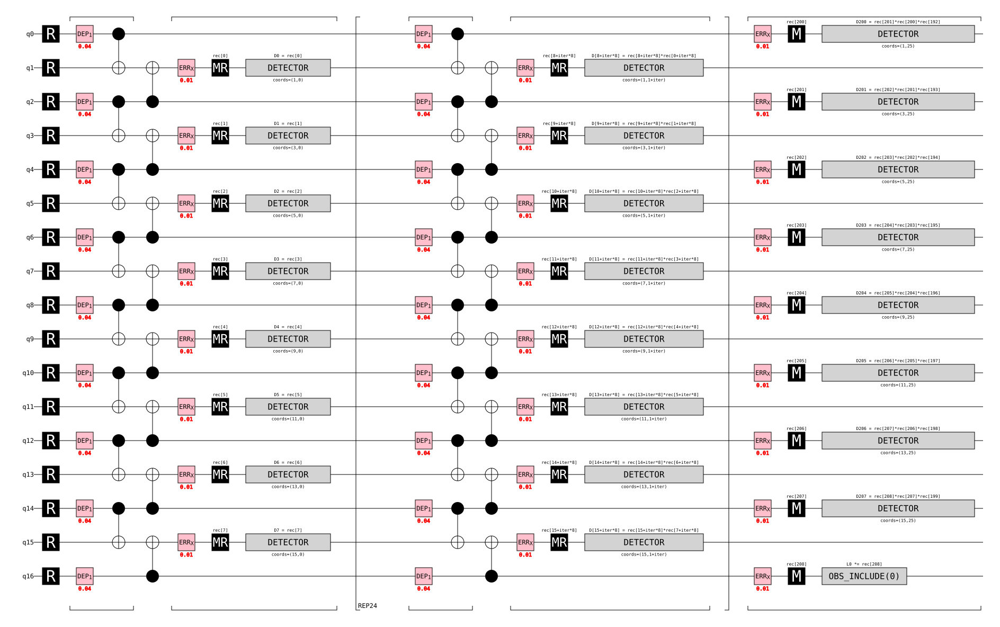
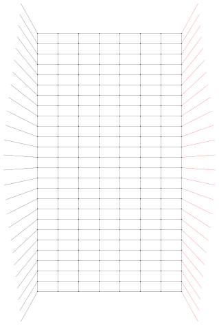
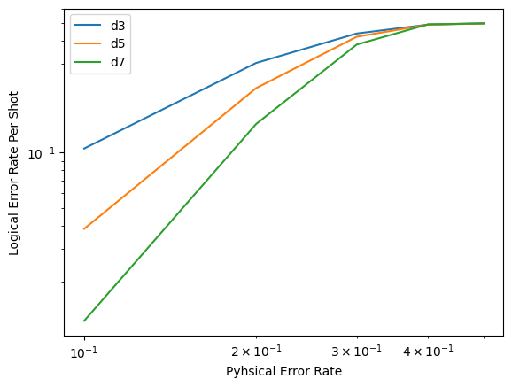
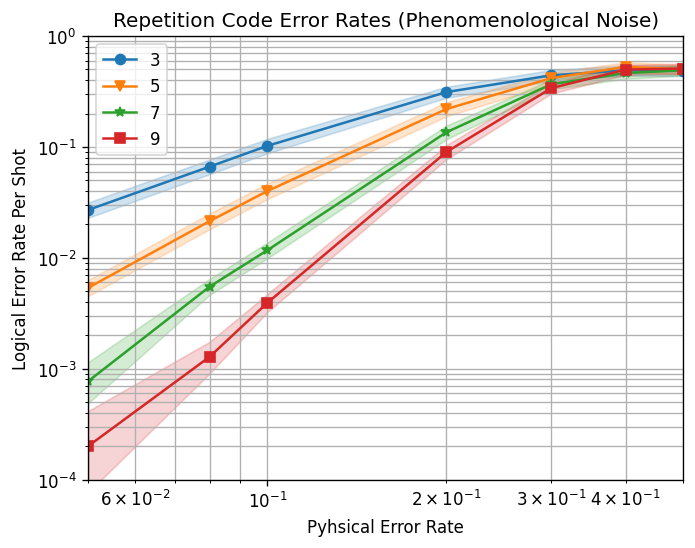

# Quantum Error Correction: Repetition Code Simulation & Threshold Estimation

A beginner-level simulation project exploring **quantum error correction (QEC)** using the **repetition code**, built with [Stim](https://github.com/quantumlib/Stim), [PyMatching](https://github.com/oscarhiggott/PyMatching), and [Sinter](https://github.com/quantumlib/Stim/tree/main/glue/sample). The project simulates noisy quantum circuits, decodes errors using a minimum-weight perfect matching (MWPM) decoder, and estimates the error-correction **threshold** of the repetition code under a phenomenological noise model.

---

## 📌 Overview

Quantum computers are extremely sensitive to noise — physical qubits lose information through decoherence and gate errors. **Quantum error correction** solves this by spreading one unit of "logical" information across many noisy "physical" qubits, so that errors can be detected and corrected without directly measuring (and destroying) the encoded quantum state.

This project implements one of the simplest QEC codes — the **repetition code** — and studies how well it protects information as the amount of physical noise and the size (distance) of the code change.

According to Google Quantum AI's research on superconducting quantum processors, error correction only works when the physical error rate is kept **below a critical threshold**; below that threshold, adding more physical qubits exponentially suppresses the logical error rate, while above it, larger codes actually perform worse. This project reproduces that same qualitative behavior in simulation.

---

## 🧠 Background Concepts

| Concept | Plain-English Explanation |
|---|---|
| **Physical qubit** | A single, noisy quantum bit (e.g., a superconducting qubit) that can flip due to errors. |
| **Logical qubit** | A qubit encoded across many physical qubits so that errors can be detected/corrected. |
| **Repetition code** | The simplest QEC code — repeats one logical bit across several physical qubits and uses parity checks to catch bit-flip errors. |
| **Code distance (d)** | Roughly, how many simultaneous errors the code can tolerate before failing. Higher `d` = more physical qubits, stronger protection. |
| **Detector** | A parity-check measurement that flags *when* an error has occurred, without revealing the encoded data. |
| **Detector Error Model (DEM)** | A graph-like summary, generated by Stim, of which physical errors trigger which detectors. |
| **Decoder (MWPM)** | An algorithm (via PyMatching) that looks at which detectors fired and infers the most likely pattern of errors, so they can be corrected. |
| **Threshold** | The physical error rate below which increasing the code distance *reduces* the logical error rate. Above threshold, larger codes get worse instead of better. |

---

## 🛠️ QEC Tools & Libraries Used

### Stim — Circuit Simulation
[Stim](https://github.com/quantumlib/Stim) is a high-performance **stabilizer circuit simulator** originally developed by Craig Gidney at Google (Gidney, *"Stim: a fast stabilizer circuit simulator,"* Quantum 5, 497, 2021). Unlike a general-purpose quantum simulator, Stim is specialized for the kind of Clifford/stabilizer circuits used in QEC, which lets it simulate circuits with thousands of qubits and millions of gates in seconds. In this project, Stim is used to:
- Generate the repetition code circuit (`stim.Circuit.generated(...)`) for a chosen code distance, number of rounds, and noise model.
- Sample raw measurement outcomes and **detector** outcomes (parity-check results that flag *when* an error occurred).
- Produce circuit and matching-graph diagrams for visualization.
- Build the Detector Error Model used by the decoder.

### Detector Error Model (DEM)
The **Detector Error Model** is Stim's compact, graph-like description of a noisy circuit: it lists every possible physical error and which detector(s) it would trigger if it occurred (`circuit.detector_error_model()`). Instead of reasoning about the full quantum circuit, a decoder only needs this much smaller error graph — each **node** is a detector, and each **edge** is a possible error connecting two detectors (or a detector to the boundary). This is what makes fast, practical decoding possible.

### PyMatching — Decoding
[PyMatching](https://github.com/oscarhiggott/PyMatching) is a fast **Minimum-Weight Perfect Matching (MWPM)** decoder built by Oscar Higgott and Craig Gidney, developed with support from the Google Quantum AI team. Given a DEM and a set of detector events from a run, PyMatching finds the most likely underlying pattern of physical errors by matching pairs of fired detectors together (Higgott & Gidney, *"Sparse Blossom: correcting a million errors per core second with minimum-weight matching,"* Quantum 9, 1600, 2025). In this project, `pymatching.Matching.from_detector_error_model(...)` builds the decoder, and `matcher.decode_batch(...)` predicts whether the logical qubit flipped for each of the 100,000 simulated shots.

### Sinter — Large-Scale Threshold Estimation
[Sinter](https://github.com/quantumlib/Stim/tree/main/glue/sample) is Stim's companion tool for automating **large-scale QEC experiments**. Where Stim simulates one circuit at a time, Sinter runs many circuits — across multiple code distances and physical error rates — in parallel, collects logical error statistics, and estimates confidence intervals for each data point. It is used here to generate the final threshold plot across d = 3, 5, 7, 9 and seven different physical error rates, using PyMatching as the decoder.

### Supporting Libraries
- **NumPy** — numerical operations (e.g., comparing predicted vs. actual logical flips).
- **Matplotlib** — plotting the logical vs. physical error rate curves.

---

## 📂 Project Structure

```
repetition-code-qec/
├── Repetition_Code.ipynb        # Main notebook: circuit generation, sampling, decoding, threshold plot
├── images/
│   ├── circuit_diagram.svg      # Repetition code circuit timeline diagram
│   ├── dem_matchgraph.svg       # Detector Error Model matching-graph diagram
│   ├── preliminary_plot.png     # Early logical-vs-physical error rate plot (d = 3, 5, 7)
│   └── threshold_plot.png       # Final Sinter-generated threshold plot (d = 3, 5, 7, 9)
└── README.md
```

> Just drop your exported images into `images/` using these exact filenames when you upload the project, and every image reference below will render automatically — no edits needed.

---

## ⚙️ Installation

This project runs in a standard Python (3.9+) environment or Google Colab.

```bash
pip install stim==1.14
pip install pymatching
pip install "sinter~=1.14"
pip install numpy matplotlib
```

---

## 🚀 What the Notebook Does (Step by Step)

1. **Installs and verifies** Stim, PyMatching, and Sinter versions.
2. **Generates a repetition code circuit** (`distance=9`, `rounds=25`) with configurable physical noise (`before_round_data_depolarization`) and measurement noise (`before_measure_flip_probability`).
3. **Visualizes the circuit** as a timeline diagram (SVG).
4. **Samples raw measurements** and **detector outcomes**, showing how single physical errors appear as persistent `1`s in raw measurements but as isolated, paired `!` events once converted to detectors.
5. **Builds a Detector Error Model (DEM)** from the circuit and visualizes it as a matching graph.
6. **Decodes samples with PyMatching**, using a `count_logical_errors()` function that compares the decoder's predictions against the actual logical-qubit flips over 100,000 shots.
7. **Compares logical error rates** at two noise levels (4% and 13%) to show how logical error rate grows with physical noise.
8. **Sweeps code distance (d = 3, 5, 7) against physical noise (0.1–0.5)** with Matplotlib to get an early look at threshold-like behavior.
9. **Uses Sinter to run a large-scale, statistically robust experiment** across d = 3, 5, 7, 9 and multiple physical error rates, then plots the final **logical error rate vs. physical error rate** graph with automatically calculated uncertainty bands.

---

## 📊 Visualizations & Results

### 1. Repetition Code Circuit


A timeline view of the distance-9 repetition code circuit (17 qubits, 25 rounds), generated directly by Stim. Each horizontal line is a qubit; the gates and resets shown are what make up one full memory experiment.

### 2. Detector Error Model (Matching Graph)


The DEM shown as a weighted graph: each node is a detector, and each edge is a possible physical error connecting two detectors (or a detector to the code boundary). This is the structure PyMatching decodes over.

### 3. Preliminary Error-Rate Sweep (Matplotlib)


An early sweep of logical error rate vs. physical error rate for d = 3, 5, 7, run directly with Matplotlib before moving to Sinter for a larger, statistically robust experiment.

### 4. Final Threshold Plot (Sinter)


The final result: logical error rate vs. physical error rate for d = 3, 5, 7, 9, generated with Sinter across ~100,000 shots per data point, with shaded confidence bands.

**Key takeaway:** At low physical error rates, larger code distances (d = 9, red) suppress the logical error rate far more effectively than smaller distances (d = 3, blue). All curves converge near a physical error rate of roughly 0.35–0.45, which marks the **pseudo-threshold** of this particular repetition code setup — above that point, larger codes stop helping and start doing slightly worse, matching the theoretical behavior described in QEC literature (including Google Quantum AI's below-threshold surface code results, *Nature*, 2024).

---

## 📖 References

- Gidney, C. *"Stim: a fast stabilizer circuit simulator."* Quantum 5, 497 (2021). https://doi.org/10.22331/q-2021-07-06-497
- Higgott, O., Gidney, C. *"Sparse Blossom: correcting a million errors per core second with minimum-weight matching."* Quantum 9, 1600 (2025). https://doi.org/10.22331/q-2025-01-20-1600
- Google Quantum AI and Collaborators. *"Quantum error correction below the surface code threshold."* Nature 638, 920–926 (2024). https://doi.org/10.1038/s41586-024-08449-y
- [Stim GitHub Repository](https://github.com/quantumlib/Stim)
- [PyMatching GitHub Repository](https://github.com/oscarhiggott/PyMatching)

---

## 👤 Author

Project by **[Your Name]** — built as a first hands-on project in quantum error correction, ahead of MS applications in quantum computing.


# Repetition Code Quantum Error Correction Simulator

A beginner-friendly simulation of a **Quantum Error Correction (QEC)** repetition code, built with [Stim](https://github.com/quantumlib/Stim) and decoded with [PyMatching](https://github.com/oscarhiggott/PyMatching), then benchmarked at scale with [Sinter](https://github.com/quantumlib/Stim/tree/main/glue/sample) to estimate the code's noise **threshold** under a simplified (phenomenological) noise model.

---

## Table of Contents

1. [Project Overview](#project-overview)
2. [What Is Quantum Error Correction? (In Simple Words)](#what-is-quantum-error-correction-in-simple-words)
3. [What Is a Repetition Code?](#what-is-a-repetition-code)
4. [Tools and Libraries Used](#tools-and-libraries-used)
5. [How the Project Works, Step by Step](#how-the-project-works-step-by-step)
6. [Results](#results)
7. [Limitations](#limitations)
8. [Future Work](#future-work)
9. [Project Structure](#project-structure)
10. [How to Run This Project](#how-to-run-this-project)
11. [What I Learned](#what-i-learned)
12. [References](#references)

---

## Project Overview

Quantum computers make mistakes very often, because qubits (the basic unit of quantum information) are extremely sensitive to noise. **Quantum Error Correction (QEC)** is the set of techniques used to protect quantum information from these mistakes.

This project simulates one of the simplest QEC codes, called the **repetition code**, and checks how well it protects information as noise increases. In simple words, this project answers the question:

> "If I copy the same piece of quantum information across many qubits, how much noise can I tolerate before the information is lost?"

The project:
- Builds a repetition code circuit with a chosen "distance" (a measure of how many qubits are used for protection).
- Adds random noise to the circuit using a **phenomenological noise model** — a simplified, idealized way of injecting noise that is easy to simulate and is commonly used as a first step before testing more detailed, gate-by-gate noise models.
- Uses a decoder to guess and undo the noise.
- Measures how often the decoder guesses wrong (this is called the **logical error rate**).
- Repeats this process for different code sizes and noise levels to find the **threshold**: the noise level below which adding more qubits actually helps, and above which it doesn't.

---

## What Is Quantum Error Correction? (In Simple Words)

Imagine you are sending a single important word over a noisy phone line, and there's a chance a letter gets scrambled. One way to protect the word is to say it three times: "APPLE, APPLE, APPLE." If the noise only scrambles one copy, the listener can still figure out the correct word by looking at the majority.

That is the basic idea behind quantum error correction. Instead of letters, we protect **qubits**. Instead of repeating words, we spread one qubit's information across several physical qubits. A **decoder** then looks at the results and figures out the most likely mistake, similar to how the listener figures out the correct word.

Google Quantum AI describes quantum error correction as essential because "quantum computers stand at the forefront of technological innovation" but are only useful at scale if their errors can be detected and fixed faster than they occur.

---

## What Is a Repetition Code?

A repetition code protects **one logical qubit** by repeating it across several **physical qubits** (called data qubits), and uses extra helper qubits (called **ancilla qubits**) to check for errors without directly looking at (and disturbing) the protected information.

In this project:
- **Code distance (d):** controls how many qubits are used. A distance-9 code uses 9 data qubits and 8 ancilla qubits (17 qubits total).
- **Rounds:** the circuit checks for errors multiple times in a row (25 rounds in this project) instead of only once, because real quantum computers need continuous error checking.
- **Noise model:** this project uses a **phenomenological noise model** — random errors are added before each round (called depolarization) and before each measurement (a small chance of flipping a result). This model is a simplified, idealized stand-in for real hardware noise: it captures the two main error sources (data errors and measurement errors) without simulating every individual gate, which makes it fast to run and a good starting point before moving to more detailed circuit-level noise models.

The **larger the distance**, the more errors the code can survive, as long as the physical noise stays below the code's threshold.

---

## Tools and Libraries Used

### Stim
[Stim](https://github.com/quantumlib/Stim) is an open-source, high-performance simulator for **stabilizer circuits** (the type of circuit used in most QEC codes), created by Craig Gidney at Google Quantum AI. According to its official paper, Stim can analyze a circuit with 20,000 qubits and 8 million gates in about 15 seconds, and then sample results at a rate of about 1,000 shots per second. It is one of the open-source tools Google Quantum AI builds and shares publicly to simulate quantum circuits and develop error correction techniques.

In this project, Stim is used to:
- Build the repetition code circuit.
- Add realistic noise to it.
- Sample measurement outcomes and "detector" outcomes (explained below).
- Convert the noisy circuit into a **Detector Error Model**.

### Detector Error Model (DEM)
A Detector Error Model is Stim's way of turning a full quantum circuit into a simplified list of "which errors cause which alarms to go off." Instead of tracking the whole circuit, the decoder only needs this simplified error map, which is much faster to work with. In this project, the DEM is saved and viewed as a graph, where each point represents a checkpoint (detector) and each connecting line represents a possible error.

### PyMatching
[PyMatching](https://github.com/oscarhiggott/PyMatching) is an open-source Python decoder written by Oscar Higgott. It implements the **Minimum-Weight Perfect Matching (MWPM)** algorithm, which is a standard, widely used method for decoding QEC codes such as the repetition code and the surface code. PyMatching takes the Detector Error Model produced by Stim, builds a weighted graph from it, and works out the most likely pattern of errors that explains what the detectors reported.

### Sinter
Sinter is Stim's companion tool for running **large-scale QEC experiments**. While Stim runs one circuit at a time, Sinter automatically runs many circuits across different code distances and noise levels, collects the statistics, and helps generate the threshold plot. In this project, Sinter is used to test code distances 3, 5, 7, and 9 against several physical error rates, using PyMatching as the decoder.

### Supporting Libraries
- **NumPy** — used for comparing the decoder's predictions against the actual results.
- **Matplotlib** — used to plot the logical error rate against the physical error rate.

---

## How the Project Works, Step by Step

1. **Build the circuit.** A repetition code circuit is generated with code distance 9, run for 25 rounds, using a phenomenological noise model with a 4% chance of noise per qubit per round and a 1% chance of a measurement flip.
2. **Look at raw measurements.** The circuit is sampled once to see the raw "yes/no" results from every qubit, every round.
3. **Look at detector events instead.** Rather than raw measurements, "detectors" are used, which only report *changes* (a new error appearing or disappearing), making the noise pattern much easier to read.
4. **Build the Detector Error Model.** The noisy circuit is converted into the DEM described above, and saved as a graph image.
5. **Decode with PyMatching.** A function repeatedly runs the circuit, gets detector events, and asks PyMatching to guess what really happened. Each guess is compared against the truth to count how many times the decoder was wrong (a **logical error**).
6. **Test at a higher noise level.** The same test is repeated with a much higher noise rate (13%) to show that logical errors increase as physical noise increases.
7. **Estimate the logical error rate** by dividing the number of wrong decoder guesses by the total number of test runs.
8. **Sweep across code distances and noise levels.** The code distance is varied (3, 5, 7) across a range of noise levels, and the logical error rate is plotted for each, using **Monte Carlo sampling** (running the same noisy experiment many times to get a reliable average).
9. **Run a large-scale benchmark with Sinter.** Sinter automatically manages thousands of simulations across code distances 3, 5, 7, and 9, and compiles the results into statistics.
10. **Plot the final threshold graph.** The logical error rate is plotted against the physical error rate for every code distance, revealing the **threshold**: the noise level where increasing the code distance stops helping.

---

## Results

### Circuit Diagram
A timeline view of the repetition code circuit, showing how each qubit is prepared, checked, and measured over multiple rounds.



### Detector Error Model Graph
A graph view of the Detector Error Model, where each point is a checkpoint (detector) and each line is a possible error the decoder needs to consider.



### Preliminary Error Rate Plot
An early comparison of logical error rate against physical error rate for a few code distances.



### Final Threshold Plot
The full threshold plot, generated using Sinter, comparing code distances 3, 5, 7, and 9 across a wider range of physical error rates. This is the key result of the project: it shows the noise level below which a bigger repetition code gives better protection.



### Key Observations

- **Low-noise regime (4% depolarization):** at distance 9, running 100,000 shots produced only a small number of logical errors, confirming the code protects the logical qubit well when physical noise is low.
  *(Fill in your exact printed count here, e.g. "There were `X` wrong predictions out of 100,000 shots".)*
- **High-noise regime (13% depolarization):** the same distance-9 code, tested under the same conditions, showed a clear increase in logical errors. This confirms the expected relationship: **more physical noise → more logical errors.**
  *(Fill in your exact printed count and computed logical error rate here.)*
- **Distance sweep (d = 3, 5, 7):** at low physical error rates, larger code distances gave a lower logical error rate. At high physical error rates, this advantage shrank or disappeared — this crossover is the signature of a noise **threshold**.
- **Sinter threshold plot (d = 3, 5, 7, 9):** the curves for different distances cross close together around a specific physical error rate. Below that point, increasing the distance helps; above it, increasing the distance stops helping (and can even hurt). Report the approximate crossing point you observed once you have run the notebook and can read it off the plot.

---

## Limitations

This project is a learning-focused simulation, and it comes with real simplifications that are worth being upfront about:

- **Phenomenological noise, not circuit-level noise.** Errors are only injected before each round and before each measurement. Real quantum hardware also has noise on every individual gate, on idle qubits, and on qubit resets. A circuit-level noise model (e.g. using `after_clifford_depolarization` and `after_reset_flip_probability` in Stim) would be a more faithful — and more complex — next step.
- **Repetition code protects against only one type of error.** This code only protects against bit-flip (or phase-flip) errors, not both at once. It cannot fully protect a general qubit the way codes like the surface code can — it is a simplified teaching example, not a code you'd use to build a real fault-tolerant qubit.
- **Single decoder tested.** Only PyMatching's Minimum-Weight Perfect Matching decoder was used. Its accuracy was not compared against other decoders (e.g. Union-Find or belief-propagation decoders), so its performance here shouldn't be read as "the best possible" result for this code.
- **No fixed random seed.** The simulations rely on random sampling, and no seed was fixed for reproducibility. Re-running the script will produce slightly different logical error counts each time (though the overall trend should hold).
- **Narrow parameter sweep.** Only a handful of code distances (3, 5, 7, 9) and a limited set of physical error rates were tested. A finer sweep would give a more precise threshold estimate.
- **No comparison to real hardware data.** All results come from simulation. Actual superconducting or trapped-ion qubits have correlated errors, leakage, and drift that this model does not capture.
- **Single noise channel.** Only depolarizing noise and measurement flips were used. Other realistic noise sources (e.g. amplitude damping, correlated crosstalk between neighboring qubits) were not modeled.

Being transparent about these limitations is intentional — it shows a clear understanding of what the simulation does and does not prove, which is exactly what's expected of a first project in this field.

---

## Future Work

- Re-run the same experiments using a **circuit-level noise model** instead of a phenomenological one, to see how much the threshold shifts.
- Extend the project to the **surface code**, which protects against both bit-flip and phase-flip errors simultaneously and is the leading candidate for real fault-tolerant quantum computers.
- Compare PyMatching's MWPM decoder against other open-source decoders to see how decoder choice affects the logical error rate.
- Fix a random seed and log exact result values for full reproducibility.
- Try Stim's `SI1000` or other more realistic pre-built noise models used in recent Google Quantum AI hardware papers.

---

## Project Structure

```
Project-R/
├── README.md
├── repetition_code.py          # Main script: circuit generation, decoding, and threshold estimation
├── Repetition Code.ipynb       # Original notebook version of the project
├── circuit_diagram.svg         # Timeline diagram of the repetition code circuit
├── dem_matchgraph.svg          # Detector Error Model graph
├── preliminary_plot.png        # Early logical vs physical error rate plot
└── threshold_plot.png          # Final threshold plot (Sinter results)
```

---

## How to Run This Project

1. Install the required packages:
   ```bash
   pip install stim==1.14
   pip install numpy
   pip install pymatching
   pip install sinter~=1.14
   pip install matplotlib
   ```
2. Run the script:
   ```bash
   python repetition_code.py
   ```
3. The circuit diagram, DEM graph, and plots will be saved as image files in the same folder.

---

## What I Learned

- How quantum information is protected using redundancy (similar to repeating a word to fight noise).
- How to build and simulate a real QEC circuit using Stim.
- How a Detector Error Model simplifies a full quantum circuit into something a decoder can use.
- How the Minimum-Weight Perfect Matching algorithm decodes errors using PyMatching.
- How to run large-scale, statistically reliable experiments with Sinter and Monte Carlo sampling.
- How to read and interpret a QEC threshold plot.

---

## References

- Gidney, C. *Stim: a fast stabilizer circuit simulator.* Quantum, 5:497, 2021. https://quantum-journal.org/papers/q-2021-07-06-497/
- Stim GitHub repository (Google Quantum AI): https://github.com/quantumlib/Stim
- Higgott, O. *PyMatching: A Python package for decoding quantum codes with minimum-weight perfect matching.* https://github.com/oscarhiggott/PyMatching
- Google Quantum AI open-source tools overview: https://developers.googleblog.com/unlocking-the-potential-of-quantum-computing-a-developers-guide-to-error-correction/
- Google Quantum AI, *Hands-on Quantum Error Correction* course: https://www.coursera.org/learn/quantum-error-correction

---

### Suggested Project Title (for CV / Resume)

**"Repetition Code QEC Simulator: Threshold Estimation with Stim & PyMatching"**

**One-line summary for CV:**
> Simulated and decoded a distance-9 quantum repetition code under a phenomenological noise model using Stim and PyMatching (MWPM decoding), then estimated the code's noise threshold across multiple code distances using Monte Carlo sampling with Sinter.
